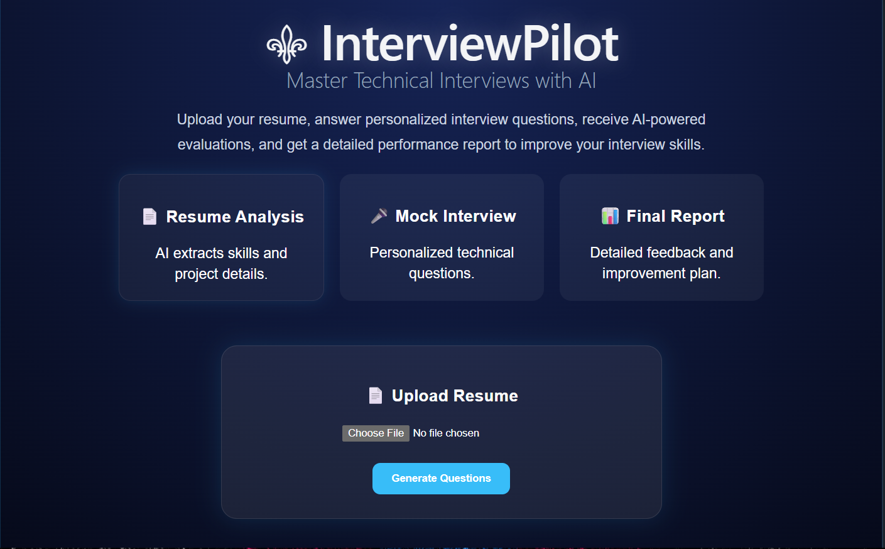
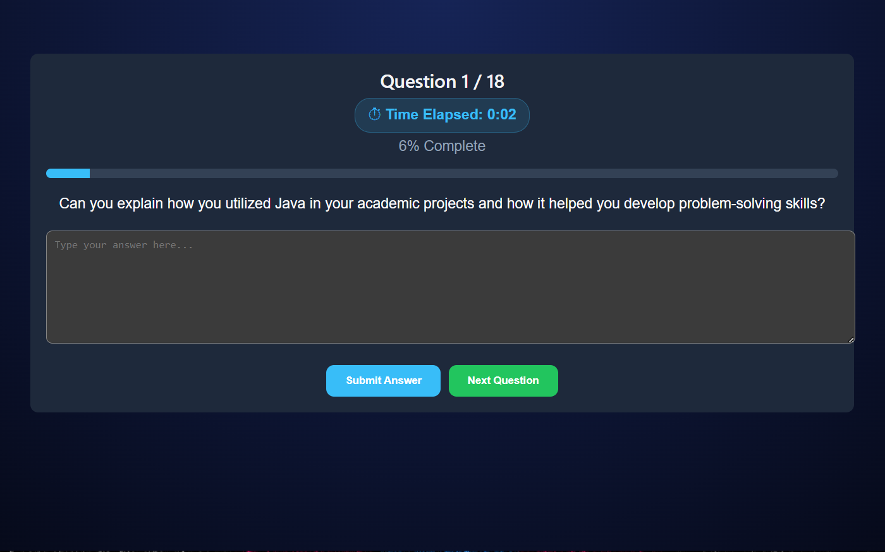
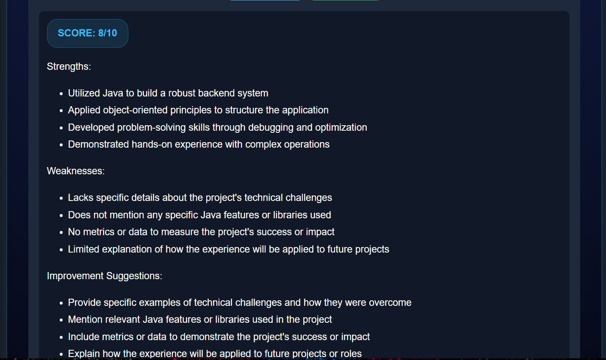
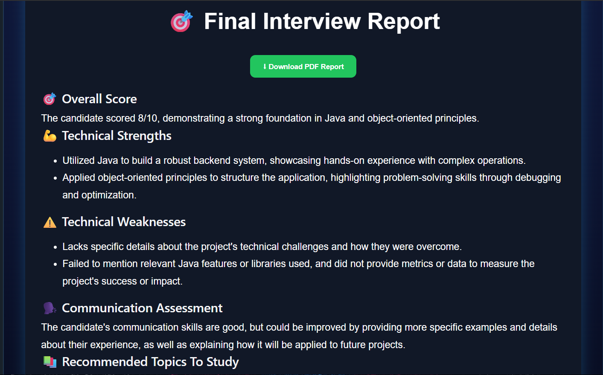

# ⚜ InterviewPilot

InterviewPilot is an AI-powered mock interview platform that helps candidates prepare for technical interviews through personalized question generation, answer evaluation, and detailed performance analysis.

---

## ✨ Features

- 📄 Resume Upload & Analysis
- 🤖 AI-Generated Technical Questions
- ⏱ Real-Time Interview Timer
- 🎯 AI Answer Evaluation
- 📊 Detailed Interview Report
- 📥 PDF Report Download
- 💡 Personalized Improvement Suggestions

---

## 🛠 Tech Stack

### Frontend
- React.js
- React Markdown
- Axios

### Backend
- FastAPI
- Python

### AI
- Groq API
- Llama 3.3 70B

### PDF Processing
- PyPDF
- jsPDF

---

## 🔄 Workflow

Resume Upload

⬇

Question Generation

⬇

Mock Interview

⬇

Answer Evaluation

⬇

Final Report Generation

⬇

PDF Export

---

## ⚙️ Installation

### Frontend

```bash
cd frontend
npm install
npm run dev
```

### Backend

```bash
cd backend
pip install -r requirements.txt
uvicorn main:app --reload
```

---

## 📸 Screenshots

### Home Page



### Interview Screen



### Evaluation Screen



### Final Report



---

## 🎯 Future Improvements

- Voice-based interviews
- Webcam monitoring
- Difficulty-based question generation
- Interview analytics dashboard
- Multiple interview domains

---

## 👨‍💻 Author

Kenaz
